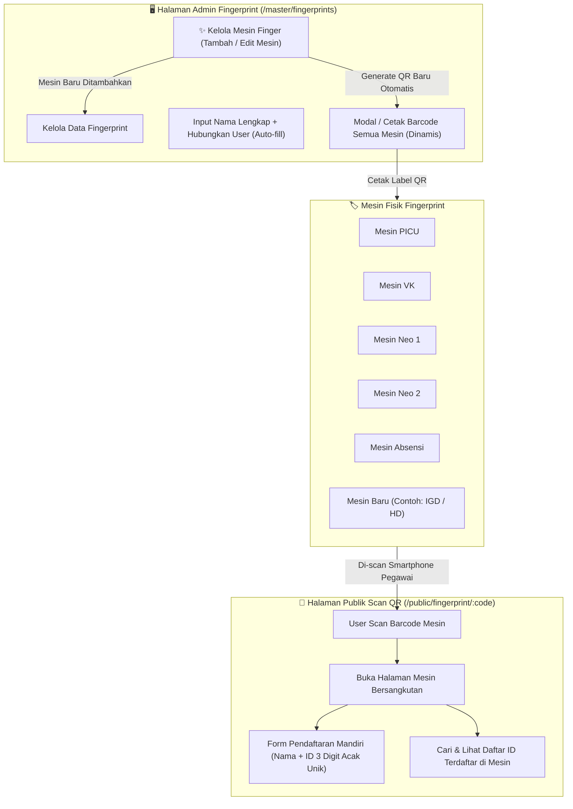

# Rencana Pengembangan Sistem Fingerprint & Manajemen Mesin Dinamis

Dokumen ini diperbarui dengan fitur **Manajemen Mesin Fingerprint Dinamis** sehingga admin dapat menambah mesin baru kapan saja tanpa batas, dan seluruh sistem (tabel, modal input, barcode, halaman pendaftaran publik) akan beradaptasi secara otomatis.

---

## 📌 Ringkasan Kebutuhan & Fitur Baru
1. **Input Nama Lengkap**: Setiap data fingerprint memiliki identitas nama lengkap personil/karyawan (wajib).
2. **Hubungkan Data User (Opsional)**: Menggantikan input `User *` yang kaku. Saat akun user dipilih, nama lengkap otomatis terisi (*auto-fill*).
3. **Manajemen Mesin Fingerprint Dinamis (Fitur Baru)**:
   - Admin dapat **menambah mesin finger baru** (contoh: "Mesin IGD", "Mesin Hemodialisa", dll.) lengkap dengan nama, kode/slug, dan lokasi.
   - Kolom tabel fingerprint, form dialog, dan modal barcode akan otomatis menyesuaikan daftar mesin yang terdaftar secara dinamis.
4. **Barcode / QR Code per Mesin**:
   - Setiap mesin (termasuk mesin baru) otomatis memiliki Barcode / QR Code tersendiri.
   - Tersedia tombol cetak/unduh kartu QR siap tempel di samping mesin fisik.
5. **Halaman Publik Pendaftaran Mandiri (`/public/fingerprint/[code]`)**:
   - Scan QR membuka halaman pendaftaran untuk mesin yang bersangkutan.
   - Form pendaftaran dengan **No ID 3-digit acak** (`001`–`999`, format 3 digit dengan padding nol seperti `005`, `042`, `215`) yang belum terpakai di mesin tersebut + tombol acak ulang.
   - Menampilkan direktori daftar ID finger terdaftar pada mesin tersebut + pencarian cepat.

---

## 🏗️ Arsitektur & Alur Sistem



---

## 🗄️ Desain Skema Database (Database Schema)

### 1. Tabel `fingerprint_machines` (Baru)
Menyimpan master data mesin fingerprint:
```sql
CREATE TABLE fingerprint_machines (
  id UUID PRIMARY KEY DEFAULT gen_random_uuid(),
  name TEXT NOT NULL,                -- Contoh: "Mesin Finger Absensi"
  code TEXT NOT NULL UNIQUE,         -- Slug URL: "absensi", "picu", "vk", "neo1", "neo2", "igd"
  location TEXT,                     -- Lokasi fisik mesin
  is_active BOOLEAN DEFAULT true,
  created_at TIMESTAMPTZ DEFAULT NOW(),
  updated_at TIMESTAMPTZ DEFAULT NOW()
);
```

### 2. Tabel `fingerprints` (Diperbarui)
Menyimpan identitas pegawai / pemilik sidik jari:
```sql
CREATE TABLE fingerprints (
  id UUID PRIMARY KEY DEFAULT gen_random_uuid(),
  name TEXT NOT NULL,                -- Nama Lengkap pegawai
  user_id UUID NULL REFERENCES profiles(id) ON DELETE SET NULL, -- Opsional
  created_at TIMESTAMPTZ DEFAULT NOW(),
  updated_at TIMESTAMPTZ DEFAULT NOW()
);

-- Partial index agar user_id unik hanya jika tidak null
CREATE UNIQUE INDEX fingerprints_user_id_unique ON fingerprints(user_id) WHERE user_id IS NOT NULL;
```

### 3. Tabel `fingerprint_machine_entries` (Relasi Mesin & ID Finger)
Menghubungkan orang, mesin, dan nomor ID finger pada mesin tersebut:
```sql
CREATE TABLE fingerprint_machine_entries (
  id UUID PRIMARY KEY DEFAULT gen_random_uuid(),
  fingerprint_id UUID NOT NULL REFERENCES fingerprints(id) ON DELETE CASCADE,
  machine_id UUID NOT NULL REFERENCES fingerprint_machines(id) ON DELETE CASCADE,
  finger_id TEXT NOT NULL,           -- Nomor ID di mesin (contoh: "203", "834")
  created_at TIMESTAMPTZ DEFAULT NOW(),
  updated_at TIMESTAMPTZ DEFAULT NOW(),
  UNIQUE(fingerprint_id, machine_id), -- 1 orang hanya punya 1 ID per mesin
  UNIQUE(machine_id, finger_id)        -- 1 ID di mesin yang sama tidak boleh bentrok
);
```

*Catatan: 16 data fingerprint eksisting (PICU, VK, Neo 1, Neo 2, Absensi) akan otomatis dimigrasikan ke relasi baru ini tanpa kehilangan data.*

---

## 🛠️ Rencana Eksekusi Bertahap

### Tahap 1: Migrasi Database & Seeding Data Eksisting
- **File**: `supabase/migrations/add_dynamic_fingerprint_machines.sql`
- **Langkah**:
  1. Buat tabel `fingerprint_machines` dan isi default data 5 mesin awal (`picu`, `vk`, `neo1`, `neo2`, `absensi`).
  2. Tambahkan kolom `name` di tabel `fingerprints` dan backfill dari `profiles.full_name`.
  3. Buat tabel `fingerprint_machine_entries` dan migrasikan data `finger_picu`, `finger_vk`, `finger_neo1`, `finger_neo2`, `finger_absensi` ke tabel baru.
  4. Siapkan policy RLS yang aman.

---

### Tahap 2: Backend & Server Actions
1. **Server Actions Mesin (`src/app/(dashboard)/master/fingerprints/machines-actions.ts`)**:
   - `getFingerprintMachines()`: Mendapatkan seluruh mesin (aktif & nonaktif).
   - `createFingerprintMachine(data)`: Tambah mesin baru (nama, code/slug otomatis/manual, lokasi).
   - `updateFingerprintMachine(id, data)`: Edit nama, lokasi, status aktif.
   - `deleteFingerprintMachine(id)`: Hapus mesin.
2. **Server Actions Fingerprint (`src/app/(dashboard)/master/fingerprints/actions.ts`)**:
   - `createFingerprint(data)`: Simpan nama lengkap, `user_id` opsional, dan array/object `machine_entries` (`{ [machineId]: finger_id }`).
   - `updateFingerprint(id, data)`: Update nama lengkap, link user, dan nomor ID di setiap mesin.
   - `deleteFingerprint(id)`: Hapus data personil.
3. **Query Hook (`src/hooks/api/use-fingerprints.ts`)**:
   - Mengambil data personil beserta seluruh `fingerprint_machine_entries`.

---

### Tahap 3: Pembaruan UI Admin Master Fingerprint
- **File**: `src/app/(dashboard)/master/fingerprints/_components/fingerprints-client.tsx`
- **Komponen & Fitur Baru**:
  1. **Tombol "Kelola Mesin" & Modal Kelola Mesin**:
     - Tabel daftar mesin fingerprint.
     - Form tambah mesin baru (+ input nama mesin, kode/slug, lokasi).
     - Tombol edit / toggle status mesin.
  2. **Kolom Tabel Dinamis**:
     - Kolom tabel fingerprint otomatis merender kolom header untuk setiap mesin aktif yang ada di database.
  3. **Dialog Tambah & Edit Dinamis**:
     - Input "Nama Lengkap *" (wajib).
     - Select / Combobox "Hubungkan Data User" (opsional) dengan auto-fill nama.
     - Input ID Finger otomatis ditampilkan untuk setiap mesin yang aktif.
  4. **Modal Barcode / QR Mesin Terintegrasi**:
     - Menampilkan grid QR Code untuk seluruh mesin yang ada di sistem (termasuk mesin yang baru ditambahkan).
     - Tombol cetak label / unduh QR code siap tempel.

---

### Tahap 4: Halaman Publik Scan Barcode Dinamis
- **Rute**: `src/app/public/fingerprint/[machine]/page.tsx`
- **Server Action**: `src/app/public/fingerprint/[machine]/actions.ts`
- **Fitur**:
  - Halaman otomatis membaca `[machine]` dari URL (bisa `picu`, `vk`, `absensi`, atau mesin baru seperti `igd`).
  - Menampilkan nama & lokasi mesin terkait.
  - **Generator 3-Digit Acak Unik**: Mengecek ID yang sudah terpakai di mesin tersebut, lalu menghasilkan nomor 3 digit (`100`–`999`) yang masih bebas. Tombol *"Acak Ulang"* siap pakai.
  - **Form Pendaftaran Mandiri**:
    - Input nama lengkap.
    - Submit -> tersimpan ke database. Jika nama sudah ada, update nomor ID mesin ini; jika belum ada, buat record baru.
  - **Daftar ID Finger Mesin Ini**:
    - Tabel kartu daftar pegawai dan nomor ID-nya pada mesin tersebut lengkap dengan pencarian cepat (*live search*).

---

### Tahap 5: Pengujian, Verifikasi & Dokumentasi
1. Jalankan migrasi dan verifikasi data eksisting tetap utuh.
2. Uji alur penambahan mesin baru (contoh: tambah mesin "Mesin IGD").
3. Verifikasi kolom tabel admin, modal add/edit, dan QR code langsung mengenali mesin baru tersebut.
4. Uji scan QR dan pendaftaran mandiri via browser smartphone / subagent.
5. Verifikasi build & TypeScript check bersih (`tsc --noEmit`).
